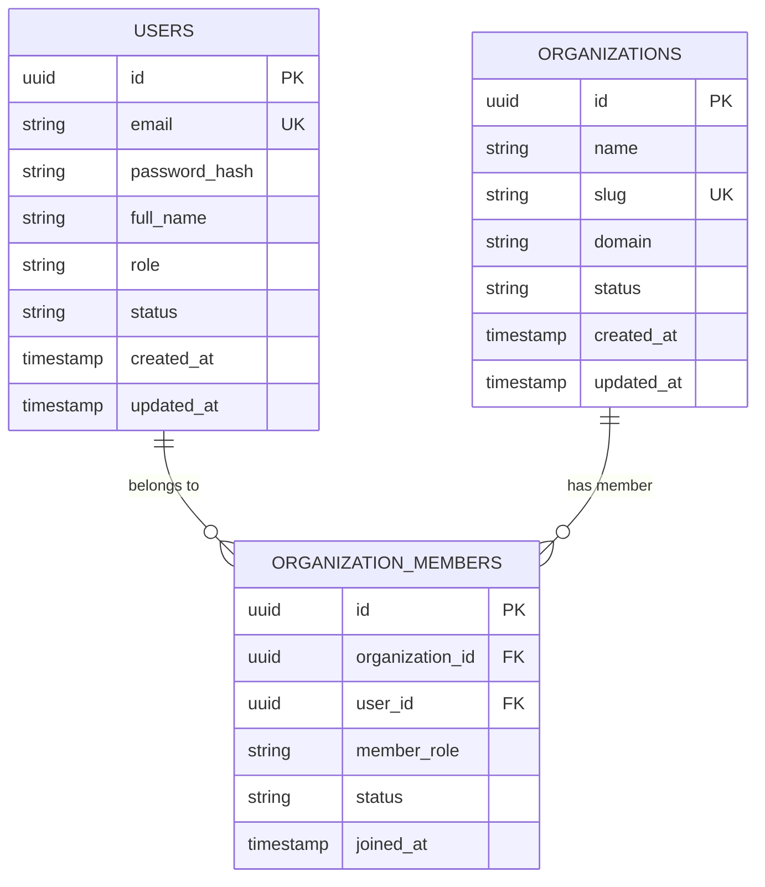

# Align Compliance Intelligence Platform — Architecture Overview

## System Context & Design Principles

Align is engineered as a deterministic compliance intelligence system.
It maps regulatory frameworks directly to corporate policy structures, Standard Operating Procedures (SOPs), runtime operational workflows, audit findings, and automated remediation tasks.

### Core Principles
1. **Zero Black-Box AI Reliance**: AI/ML components are non-critical assist modules; system integrity relies on deterministic state machines and relational mappings.
2. **Vertical Slice Architecture**: Feature slices span full-stack (UI component -> REST DTO -> Domain Entity -> Database Schema -> Audit Log).
3. **Auditability & Traceability**: Every compliance mapping and policy delta retains strict temporal lineage.

---

## Domain Entity Model (Phase 0 Foundation)

