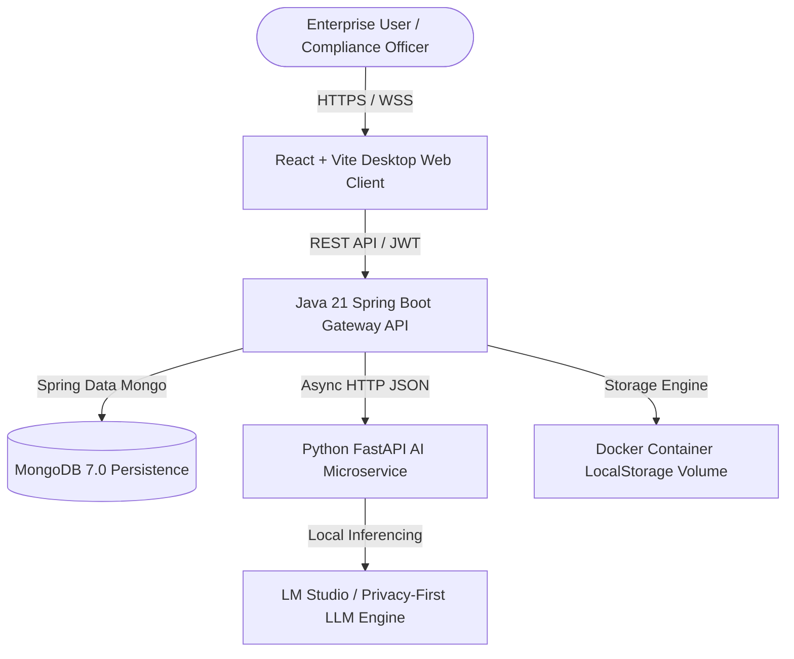

# ALIGN. — Enterprise Compliance & Operational Drift Intelligence Platform

> **Tagline:** Statutory & SOP Workspace — Bridging the Gap Between Regulatory Intent and Operational Reality.

---

## Executive Summary

**ALIGN.** is a next-generation, privacy-first enterprise compliance intelligence platform built to solve one of the most expensive and high-risk problems facing modern enterprise organizations: **Operational Drift and Regulatory Disconnect**.

While traditional GRC (Governance, Risk, and Compliance) solutions operate as static file repositories or manual survey check-lists, **ALIGN.** introduces a **deterministic compliance lineage state machine** combined with **privacy-preserving local AI intelligence**. It links statutory obligations directly to internal Standard Operating Procedures (SOPs), continuously monitors real-world operational event sequences for process drift, identifies compliance gaps before external audits, and orchestrates end-to-end remediation workflows.

---

## 1. What is the Project For & Why Are We Building This?

### The Core Problem
In heavily regulated industries (Financial Services, Healthcare, Lifesciences, Defense, Energy, and SaaS), regulatory standards are constantly evolving (e.g., ISO 27001, HIPAA, GDPR, SOC 2, DORA, EU AI Act). Organizations spend millions of dollars hiring external auditors, compliance officers, and legal advisors to map these regulations into internal policy documents and Standard Operating Procedures (SOPs).

However, **two fatal breakdowns occur in practice**:

1. **The Policy-to-SOP Disconnect (Static Gap)**:
   - Regulations change, but internal SOPs remain outdated.
   - Compliance officers cannot easily answer: *"Which exact SOP section addresses Clause 4.2 of HIPAA 164.312?"*
2. **Operational Drift (Dynamic Reality Gap)**:
   - Employees execute daily tasks differently from what is written in the approved SOP.
   - Example: An SOP mandates `Create Support Ticket -> Log Customer Consent -> Resolve Issue`. In reality, engineers perform `Resolve Issue -> Create Support Ticket` due to high workload. This out-of-order execution violates statutory controls without triggering traditional IT system alerts.

### Why We Are Building ALIGN.
We built **ALIGN.** to eradicate the manual, high-friction, error-prone compliance audit cycle. By replacing static PDF filing cabinets with a **live compliance graph**, organizations gain real-time visibility into regulatory coverage, version change impact analysis, and runtime operational adherence.

---

## 2. Platform Architecture & Monorepo Overview

ALIGN. is architected as a robust, enterprise-grade polyglot monorepo engineered for scalability, security, and low-latency operation:

```text
/
├── frontend/             # React + TypeScript + Vite + Custom Glassmorphism UI
├── backend/              # Java 21 + Spring Boot 3 + Spring Data MongoDB + Spring Security JWT
├── ai-service/           # Python 3.11 + FastAPI + LM Studio / Local LLM / Semantic Matcher
├── docs/                 # Architectural Specs & Domain Models
└── docker-compose.yml    # Full Multi-Container Orchestration
```

### Full-Stack Microservices Architecture



---

## 3. Unique Selling Proposition (USP) & Novelty

### Key USPs

| Feature | Traditional GRC Tools (ServiceNow, Vanta) | ALIGN. Enterprise Platform |
| :--- | :--- | :--- |
| **Compliance Lineage** | Manual mapping tables in spreadsheets | **Deterministic Graphical Lineage** (Regulation → Clause → SOP → Execution Log) |
| **Operational Adherence** | Static self-assessment questionnaires | **Runtime Process Drift Engine** (Analyzes actual telemetry & event sequences) |
| **AI Privacy Model** | Mandates sending confidential SOPs to public Cloud APIs (OpenAI/Anthropic) | **100% On-Premise / Air-Gapped Local LLM** (LM Studio / Ollama Integration) |
| **Version Change Impact** | Manual re-auditing required for every regulation update | **Automated AI Semantic Delta Impact Analysis** |
| **Audit Readiness** | Weeks of manual evidence gathering before audits | **Continuous 100/100 Health Scoring & Instant Audit Log Generation** |

### Core Technical Novelties

1. **Process Drift & Sequence Anomaly Detector**:
   - Compares expected SOP sequence vectors (e.g., `Step A -> Step B -> Step C`) against real-time operational execution logs (e.g., `Step B -> Step A`).
   - Dynamically calculates a quantitative **SOP Health Score (0–100)** and flags out-of-order execution cases.
2. **AI Candidate Semantic Matcher**:
   - Uses localized embeddings and lightweight zero-shot LLM prompts to analyze raw statutory requirement text against SOP clause chunks.
   - Recommends coverage candidates with confidence percentages and reasoning summaries, requiring human-in-the-loop reviewer approval (`ACCEPT` / `REJECT`).
3. **Deterministic Spring Security DBRef Security Layer**:
   - Custom MongoDB DBRef query resolvers ensure multi-tenant organization boundaries are enforced at the database layer with zero data leakage.

---

## 4. Market Analysis & Target Customer

### Market Opportunity & TAM
- **Global Governance, Risk, and Compliance (GRC) Market Size**: Valued at **$47.2 Billion in 2023**, projected to reach **$134.8 Billion by 2032** (CAGR of 12.4%).
- **Key Market Drivers**:
  - Skyrocketing regulatory penalties (e.g., GDPR fines exceeding €4 Billion, DORA enforcement in Europe, HIPAA non-compliance penalties).
  - Rapid shift towards enterprise privacy requirements where enterprise legal teams ban sending internal SOPs and proprietary workflows to third-party cloud AI vendors.

### Target Customer Segments

1. **Enterprise Compliance Officers & Chief Information Security Officers (CISOs)**:
   - Needs to demonstrate continuous regulatory compliance for SOC 2 Type II, ISO 27001, HIPAA, or FedRAMP.
2. **Regulated FinTech & HealthTech Scaleups (Series A to Series C)**:
   - Rapidly expanding engineering & operations teams where SOP discipline drops, introducing operational risks.
3. **Defense Contractors & Government Entities**:
   - Require strictly air-gapped, on-premise AI systems with 0 outbound internet telemetry.

---

## 5. Business Model & Monetization Strategy

ALIGN. operates on a high-margin **B2B SaaS & Enterprise On-Premise License Model**:

```
                              ┌─────────────────────────────────────────┐
                              │     ALIGN. MONETIZATION TIERS          │
                              └────────────────────┬────────────────────┘
                                                   │
         ┌─────────────────────────────────────────┼─────────────────────────────────────────┐
         │                                         │                                         │
┌────────┴────────┐                       ┌────────┴────────┐                       ┌────────┴────────┐
│   ENTERPRISE    │                       │   SCALE-UP      │                       │   AIR-GAPPED    │
│    CLOUDS       │                       │    SAAS         │                       │   ON-PREM       │
├─────────────────┤                       ├─────────────────┤                       ├─────────────────┤
│ $2,499 / Month  │                       │ $499 / Month    │                       │ $45,000 / Year  │
│ Up to 10 Orgs   │                       │ 1 Organization  │                       │ Dedicated Local │
│ Multi-Tenant    │                       │ Cloud Hosted    │                       │ Air-Gapped LLM  │
│ Standard SLA    │                       │ 50 SOP Limit    │                       │ Unlimited Orgs  │
└─────────────────┘                       └─────────────────┘                       └─────────────────┘
```

1. **Professional Scaleup Tier ($499/mo)**: Single organization workspace, up to 50 active SOPs, cloud-hosted AI matcher.
2. **Enterprise Cloud Tier ($2,499/mo)**: Multi-organization workspace, unlimited SOP versioning, AI compliance candidate matching, full audit log export.
3. **Defense / Air-Gapped On-Premise License ($45,000+/year per instance)**: Self-hosted Docker / Kubernetes deployment with local LLM integration and dedicated SLA.
4. **Professional Services & Audit Readiness Add-On ($10,000 per audit cycle)**: Turnkey onboarding and custom process drift integration connectors (Jira, ServiceNow, Datadog).

---

## 6. Project Status: Implemented vs. Roadmapped

### Fully Implemented (Completed & Verified)

- [x] **Authentication & Multi-Tenant Organization Management**:
  - User registration, JWT authentication, demo database seeder, organization creation with custom logo uploads, DBRef security isolation.
- [x] **Regulations & Requirements Library**:
  - Full CRUD for regulatory frameworks, jurisdictional metadata, active vs. superseded status, section requirement clause extraction.
- [x] **SOP Workspace & Version Control**:
  - Multi-format file uploads (PDF, DOCX, TXT), version history logging, document storage abstraction (`LocalStorageService`), file download streams.
- [x] **Compliance Mapping Lineage Engine**:
  - Mapping regulatory requirement clauses directly to SOP documents with coverage type indicators (`FULL`, `PARTIAL`, `NOT_IMPLEMENTED`, `NOT_APPLICABLE`).
- [x] **AI Compliance Intelligence Microservice**:
  - Python FastAPI microservice with LM Studio provider integration for semantic candidate matching, conflict analysis, finding explanations, and remediation recommendations.
- [x] **SOP Process Health & Operational Drift Engine**:
  - Real-time sequence analysis, health scoring (0–100), simulation model for operational evidence cases, anomaly detection.
- [x] **Apple-Inspired Design System & UI/UX**:
  - Dynamic light/dark theme switcher, anti-flash FOUC script, WebGL Chromatic Waves background, mobile navigation floating dock, responsive 2-column asymmetric grid layouts across all detail pages.

### Roadmapped Extensions (For Future Milestones)

- [ ] **Automated Telemetry Connectors**:
  - Webhook listeners for Datadog, AWS CloudTrail, and Jira to automatically ingest real-world operational logs into the Process Drift engine without manual simulation.
- [ ] **PDF Clause OCR Parsing Pipeline**:
  - Direct upload and automatic text extraction/parsing of PDF regulatory gazettes into individual section requirement clauses using `pypdf` / `Tesseract`.
- [ ] **One-Click Audit Package Exporter**:
  - Export complete compliance readiness reports as cryptographically signed PDF compliance certificates with complete lineage provenance.

---

## 7. Hackathon Winning Elevator Pitch

> *"Compliance in 2026 is broken. Companies spend millions writing SOPs to satisfy regulations, but they have zero visibility into whether their employees actually follow those SOPs during daily operations. **ALIGN.** changes the game. We’ve built the world’s first privacy-first compliance platform that pairs a **deterministic regulatory lineage graph** with a **runtime process drift engine**. By running 100% local AI models, enterprise data never leaves the building. ALIGN. doesn't just store policies—it guarantees operational compliance in real time."*
